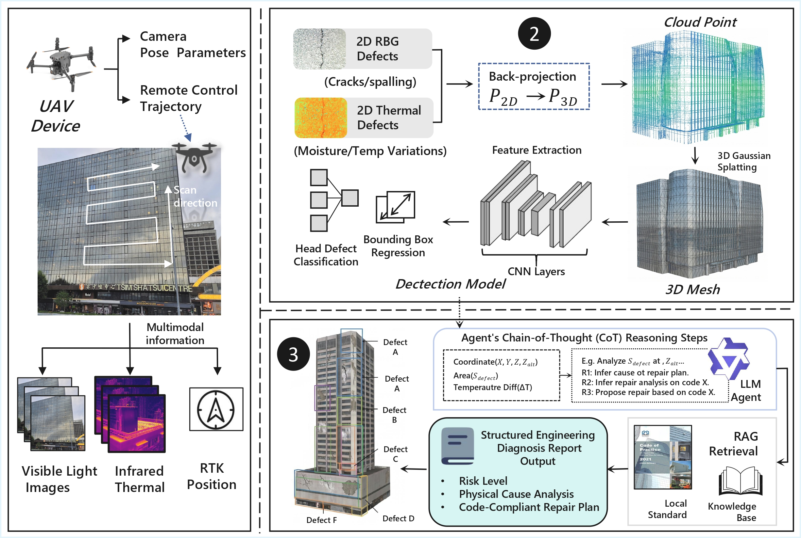

# Interpretable Multimodal Agents for Facade Defect Detection



## What Is the Interpretable Multimodal Agent?

An end-to-end interpretable multimodal agent framework that fuses **3D digital twins**, **visual–thermal perception**, and **RAG-driven engineering guidelines** for standard building defect prognosis.

---

## Environment setup

```bash
cd /path/to/facade-defect-agent   # your clone
python -m venv .venv
source .venv/bin/activate   # Windows: .venv\Scripts\activate
pip install -U pip
pip install -r requirements.txt
```

---

## Create your own knowledge base 

1. Place **PDF** textbooks under `agent/RAG-knowledge-base/textbook/` (or pass `--textbook_dir`).

2. **Build the vector store** (from repository root):

   ```bash
   export FACADE_EMBEDDING_MODEL="Qwen/Qwen3-Embedding-0.6B"
   python agent/RAG-knowledge-base/embedding/build_vector_store.py \
     --textbook_dir agent/RAG-knowledge-base/textbook \
     --output_dir agent/RAG-knowledge-base/embedding/store \
     --model_path "$FACADE_EMBEDDING_MODEL"
   ```

3. The embedding model used at **build** time must match **retrieval** time (same vector dimension). Adjust `--chunk_size` / `--overlap` in `build_vector_store.py` if needed.

4. Edit `agent/RAG-knowledge-base/prompt/system_prompt.md` and `cot_prompt.md` for domain-specific instructions.

---

## Multimodal inference

### Batch RGB + thermal + RAG 

```bash
python agent/run_vl_rag_batch.py \
  --label_json dataset/image/labels.jsonl \
  --image_root dataset/image/your_session \
  --store_dir agent/RAG-knowledge-base/embedding/store \
  --out_dir result/my_vl_rag_run \
  --num_locations 50
```
